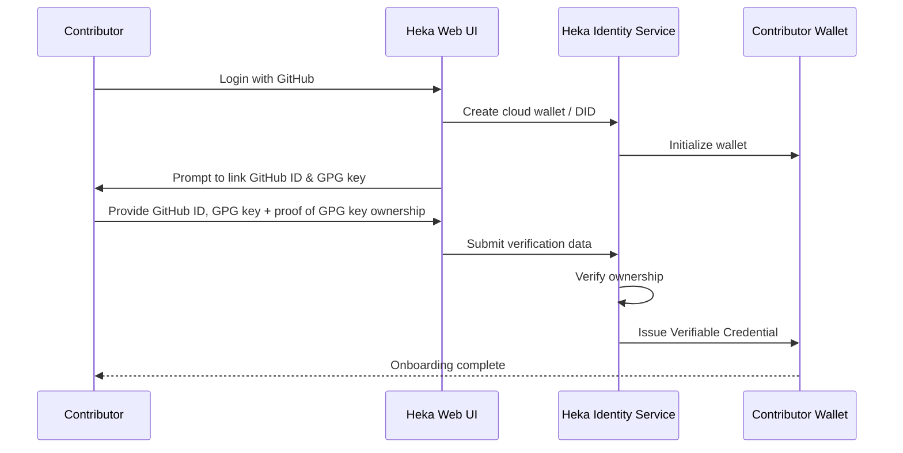
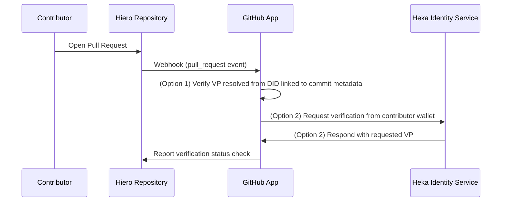

## Title: Hiero Contributor Identity Verification Prototype

Hiero Contributor Identity Verification is a mentorship project proposal for Hiero.
The proposal involves building a contributor identity verification prototype leveraging Heka Identity Platform and custom GitHub App.

## Primary Focus

Coding

## Description

Open source collaboration platforms rely heavily on email-based identity and platform accounts for contributor attribution.
While widely adopted and convenient, this model has limitations: commit author metadata can be spoofed, contributor identity is fragmented across projects / ecosystems and hard to verify, and trust relationships are challenging to establish without additional verification on a person-to-person basis.

Current GitHub contribution workflows face multiple risks, including commit author impersonation and email-based identity spoofing.
These risks became even more relevant with advancements of Agentic AI capable of identity impersonation and "flooding" open source projects with low-quality or even malicious contributions.

From a technical perspective, there are many ways to mitigate these risks. However, not all of them are suitable for open source specifically – decentralized and transparent trust along with self-sovereign identity management are crucial factors.
Compromising on these principles can lead to a less trustworthy relationship between individual contributors and the projects, as well as it can create a higher entry barrier for new contributors.

We believe that decentralized identity concepts ([Decentralized Identifiers (DIDs)](https://www.w3.org/TR/did-1.1/) and [Verifiable Credentials (VCs)](https://www.w3.org/TR/vc-data-model-2.0/)) can help to mitigate the spoofing and impersonation risks without compromising trust, providing a more secure and trustworthy way to recognize contributors.

This project proposes the development of a prototype (with long-term development potential) for contributor identity validation in Hiero that will leverage existing tools / applications available in Hiero Identity ecosystem, including the new [Heka Identity Platform](https://github.com/hiero-ledger/heka-identity-platform).
The prototype will be tested in a real-world scenario using one of Hiero open-source repositories (e.g., [Identity Collaboration Hub](https://github.com/hiero-ledger/identity-collaboration-hub), DID SDKs, or Heka Identity Platform repo itself).

Core standards and technologies to be used:
- [Decentralized Identifiers (DIDs)](https://www.w3.org/TR/did-1.1/) and [Verifiable Credentials (VCs)](https://www.w3.org/TR/vc-data-model-2.0/)
- [Hedera DID Method](https://github.com/hashgraph/did-method/blob/master/hedera-did-method-specification.md)
- OpenID for Verifiable Credentials (OID4VC)
  - [OpenID for Verifiable Credential Issuance (OID4VCI)](https://openid.net/specs/openid-4-verifiable-credential-issuance-1_0.html)
  - [OpenID for Verifiable Presentations (OID4VP)](https://openid.net/specs/openid-4-verifiable-presentations-1_0.html)
- [SD-JWT VC format](https://datatracker.ietf.org/doc/draft-ietf-oauth-sd-jwt-vc/)
- [GitHub Apps](https://docs.github.com/en/apps/creating-github-apps/about-creating-github-apps/about-creating-github-apps)
- Cryptographically linked developer keys (GPG)

Core components:
- [Heka Identity Platform](https://github.com/hiero-ledger/heka-identity-platform) (acting as a contributor onboarding and verification platform)
- Custom GitHub App for contributor identity verification

While Heka Identity Platform is an existing project under Hiero, the scope of work for a proposed project includes changes and integration mechanisms necessary to implement the onboarding and verification flow.

### High-level contributor onboarding flow
1. Contributor opens Heka Contributor Verification Web UI and logs in with their GitHub account
2. Under the hood, Heka Identity Service creates a cloud wallet for a contributor and, optionally, a public DID (hosted on Hedera or other VDR)
3. Contributor is prompted to link their GitHub account ID and GPG key (with proof of ownership) to their wallet in Heka
4. Heka Identity Service issues a Verifiable Credential containing contributor metadata to the contributor wallet
   * If contributor DID is used, Linked Verifiable Presentation (VP) can be added to the contributor DID Document to simplify verification flow
   * VC is anchored on Hedera via issuer DID

**Diagram**

### High-level verification flow
1. Contributor opens a pull request in Hiero repository
2. GitHub App verifies the pull request author's identity using the linked DID / cloud wallet
   * Contributor DID, if used, can be linked to a commit or resolved via Heka Identity Service registry
3. GitHub App reports the verification result as a GitHub status check

**Diagram**

Please note that the described flows are draft and subject to change during the extended design phase.

## Learning Objectives

- Understand open-source supply chain security risks and how decentralized identity can mitigate them
- Learn about relevant decentralized identity standards and protocols
- Learn how to work with the Hiero Identity ecosystem, including full-stack Heka Identity Platform
- Learn how to integrate decentralized identity features in real-world scenarios, understand implications and specific benefits
- Understand how to design and build GitHub Apps for workflow automation
- Learn how to integrate cryptographic verification (GPG, public-key) into backend services
- Gain experience in building scalable and secure identity verification flow

## Expected Outcome and Deliverables

The successful completion of this project will result in a working prototype for contributor identity verification that can be used safely across Hiero repositories.

Expected deliverables include:
- A GitHub App capable of verifying contributor identity using DID and VC / VP
- Implementation of a contributor onboarding workflow based on Heka Identity Platform
- Implementation of pull request verification workflow leveraging contributor DID and Linked VP
- Full integration demo with GitHub pull requests in one of the Hiero repositories
- Documentation and high-level design for future development

## Relation to LF Decentralized Trust and impact on the community

This project will support the Hiero ecosystem by reducing impersonation and spoofing risks in open source.
Another specific benefit for Hiero community would be an active synergy between Hiero Decentralized Identity (DID SDKs and Heka Identity Platform) and the rest of the ecosystem - Hiero-based identity tools creating a more secure contribution environment in Hiero itself.

The project also has broader value for the LF Decentralized Trust community because it serves as a reference implementation for decentralized trust in OSS workflows (real-life use case).
The proposed concept also aims to be fundamentally aligned with the ongoing initiative of integrating a trust model based on a decentralized trust graph for Linux Kernel contribution flow ([OpenVTC LFDT Lab](https://github.com/LF-Decentralized-Trust-labs/openvtc)).
While the proposed concept suggests a different practical implementation, it can directly leverage the Verifiable Trust Community (VTC) approach in the future.

## Recommended Skills

- Proficiency in Node.js/TypeScript backend development
- Experience in React frontend development
- Basic experience with GitHub Apps, webhooks, and GitHub APIs
- Basic understanding of cryptography (GPG, public-key verification)
- Familiarity with DIDs and Verifiable Credentials (preferred)
- Understanding of software architecture and building maintainable automation systems
- Prior contributions to open source projects

## Mentor(s) Names and Contact Info

Name: Alexander Shenshin
Email: alexander.shenshin@dsr-corporation.com
Company affiliation: DSR Corporation

## Additional Information

The project will follow a phased implementation plan:

1. **Research & Design**: Define credential schema, trust rules, and integration approach based on proposed design
2. **Contributor Onboarding**: Implement contributor onboarding workflow and linking of GitHub account/GPG key
3. **GitHub App Verification**: Implement webhook handling and credential verification logic (GitHub App)
4. **Integration & Testing**: End-to-end tests with various PR scenarios and final demo (in one of Hiero repositories)

The project should pay special attention to:

- Correct implementation of a decentralized identity trust model
- Safety and permissions of automated actions
- Transparency of verification decisions
- Repository-specific configurability
- Design and implementation decisions that enable extensibility and long-term scalability (for a prototype)